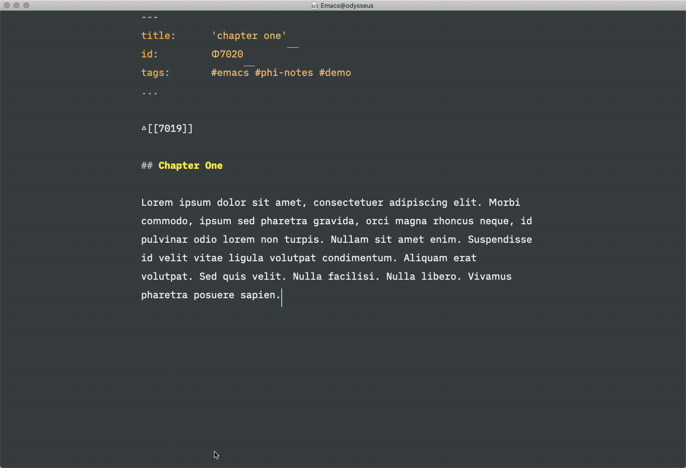

# phi-notes
 
This emacs package provides a `phi-mode` minor-mode for a Zettelkasten-style notetaking system with the following characteristics:

- Notes are identified by unique, sequential numbers (`0001`, `0002` etc.).
- Notes may be linked using the wikilink syntax (`[[0001]]`).
- Notes may have "parent" and "descendant" notes; they may also be linked to project notes.
- Bibliographical annotation is supported with appropriate BibTeX references.
- Notes may have tags (identified by `#hashtags`).
- Notes have a YAML(ish) frontmatter to keep metadata and are (preferrably, but not necessarily) written in Markdown.

The aim of this project is to develop features to ease the creation, navegation and linking of notes in one or multiple note repositories. 

A sidebar functionality makes the minor-mode particularly useful for working with structure notes:



Recomended usage with `olivetti-mode`, `helm`, `helm-ag` and `helm-bibtex`.

## Setup

### Package instalation

For Spacemacs, I'd recommend creating a layer (`M-x configuration-layer/create-layer`) under  `~/.emacs.d/private/phi`. Add the following to `packages.el`:

```lisp
(defconst phi-packages
  '((phi-notes :location local)))

(with-eval-after-load 'helm-bibtex
  (helm-bibtex-helmify-action bibtex-completion-create-phi-note helm-bibtex-create-phi-note)
  (helm-add-action-to-source'
   "Create PHI bibliographical annotation" 'helm-bibtex-create-phi-note
   helm-source-bibtex 1))

(with-eval-after-load 'markdown-mode
  (add-hook 'markdown-mode-hook 'phi-mode))
```

And this to `keybindings.el`:

```lisp
(spacemacs/set-leader-keys "az" 'helm-phi-open-repo)
(spacemacs/set-leader-keys "Co" 'phi-new-originating-note)
(global-set-key (kbd "C-c )") 'helm-bibtex)
```

You may skip the lines of code for `helm-bibtex` if you're not working with bibliographical annotations (but you should).

Then, clone the package inside a local directory:

```shell
cd ~/.emacs.d/private/phi
mkdir local
cd local

git clone https://github.com/brunocbr/phi-notes.git
```

Open your `.spacemacs` configuration (`M-m f e d`) and add `phi` to `dotspacemacs-configuration-layers`. Restart emacs or reload the configuration (`M-m f e R`).

### Configure your note repository

A `.counter` file is kept in the same directory of your notes in order to keep the value of the incremental counter used for generating note ids. To initialize it, use the interactive function `M-x phi-initialize-counter`, which will prompt for the desired note directory.

You may then configure one or multiple repositories with `customize-variable phi-repository-alist`. The list will contain elements consisting in a name of the repository, a corresponding directory and an optional value for the "master note" id (which is the default note displayed in the sidebar in absence of a project or parent note). This setup is also needed for the creation of independent, originating notes (`M-m C o` if you used the configuration above), when it makes sense to prompt for a location to create them. All the other functionalities are sensitive to the context of the file currently being visited.


## Usage

### Key bindings

Open a repository:


| Key binding                            | Description                                                                        |
| -----------                            | -----------                                                                        |
| `M-x a z` (or other global keybinding) | `helm-phi-open-repo`. Search notes titles (`heml` actions may be used, see below). |

Navigation:

| Key binding | Description                                                                                                                            |
| ----------- | -----------                                                                                                                            |
| `C-c ;`     | Toggle the sidebar. It will show one of the following notes: a project note, the parent note, or the "master note" for the repository. |
| `C-c :`     | Show the sidebar and give it focus.                                                                                                    |
| `C-c u`     | Visit parent note.                                                                                                                     |
| `C-c j`     | Visit the next link to the right.                                                                                                      |

Creating notes:

| Key binding                     | Description                                                                                                                                                                                                                                                                                                                                                                              |
| -----------                     | -----------                                                                                                                                                                                                                                                                                                                                                                              |
| `M-m C o` (or other global key) | `phi-new-originating-note`. Create a new "originating" note, with no parent. It will prompt for a repository in case you have more than one configured in  `phi-repository-alist`.                                                                                                                                                                                                    |
| `C-c n d`                       | `phi-new-descendant-note`. Create a note descending from the one currently being visited. The title and a wikilink will be inserted before visiting the new note. You may prefix this command with `C-u` to visit the newly created note in another window.                                                                                                                              |
| `C-c n y`                       | `phi-yank-to-new-note`. If you have previously killed a region, you may use this command (e. g. when visiting a structure note) to create a link to a new note which will have the contents "yanked" to it. The command will prompt for a title which will be by default extracted from the first line of the killed region, eliminating `#`s if needed.  This is useful for reorganizing contents in different notes. |
| `C-c n k`                       | `phi-kill-to-new-note`. Similar to the above, but may be used immediately after marking a region, which will be thus substituted with a link to a new note containing the "killed" contents. May be used e. g. when breaking a long note into more atomical ones.                                                                                                                        |

You may also create [bibliographical annotation notes](#bibliographical-annotation) from `helm-bibtex` (bound to `C-c )`); see below.

Searching and inserting links to other notes:

| Key binding | Description                                                                                                                                                                                                                   |
| ----------- | -----------                                                                                                                                                                                                                   |
| `C-c i`     | `helm-phi-find`. Search by note title or id.  |
| `C-c f f`   | `helm-ag-phi-find`. Search the contents of the repository with `helm-ag`. You may configure it for different engines (such as `ripgrep`).                                                                                     |
| `C-c f b`   | `helm-ag-phi-find-backlinks`. Search the notes for links poiting to the current one.                                                                                                                                          |
| `C-c f t`   | `helm-ag-phi-find-like-tags`. Search notes with similar tags.                                                                                                                                

With the `helm` and `helm-ag` command the following actions are available:

- Open the note;
- Insert (in the current buffer) a wikilink to the selected note;
- Insert title and wikilink;
- Insert title and wikikink and assign the note to the current project (i.e the file being visited), by modifying the linked note's `proj` field.

## Anatomy of PHI notes

A `PHI` note contains in its first lines a YAML(ish) frontmatter, which is typically like this:

```yaml
---
title:		'alists'  
id:	   	Φ7013  
tags:	 	#emacs #lisp
...
```

And, just below it, separated by an empty line, a breadcrumb with symbols, followed by wikilinks, pointing to parent (△) or descendant (▽) notes; it may also identify an originating note with no parents (○):

```
△[[7012]]
```

The symbols may be customized. `title` and `id` fields and simply redundant; the package will always extract this information from the actual filename.
 
The frontmatter may also contain other fields (see below), depending on the kind of the note.

### Bibliographical annotation

The fields `citekey` and `loc` in the frontmatter are used for bibliographical annotation notes. They link a corresponding BibTeX reference and location in the work (most often a page interval). A tag (`#ƒ`) is also used to identify this kind of note (in distinction to "idea" notes which are my own).

It's very typical to have a structure note (with `loc` = 0) as an index pointing to other notes (for different chapters, sections or topics). E. g.:

```yaml
---
title:		'Diès, A. (1932) La définition de l‘Être et la nature des idées dans le Sophiste de Platon'   
id:		Φ2105  
citekey:	Dies1932  
loc:		0   
tags:		#plato #ƒ
...
```

The above kind of note can be quickly created out of bibliographical information already stored in the BibTeX base by means of the `helm-bibtex` action to `Create PHI bibliographical annotation`.

Descendant notes (created with `C-c n d`) will carry the bibliographical information by default.

### Project notes

The sidebar feature is very useful with project notes. The package will detect if the note being visited is linked to a project note by looking for this information in the frontmatter; if it is, the project note will be displayed in the sidebar when it is invoked (`C-c ;` or `C-c :`).

This line will identify a project the note is linked to:

```yaml
proj:	[[7000]]
```


### Attribute fields list

| Key       | Description                                                                                                   |
| --------- | -----------                                                                                                   |
| `title`   | The note title.                                                                                               |
| `id`      | The unique numerical identification for the note (almost aways preceded by φ).                                |
| `citekey` | A BibTeX key for the bibliographical reference associated with the note.                                      |
| `loc`     | The location (usually a page interval) in the associated bibliographical reference.                           |
| `tags`    | A sequence of hash tags separated by spaces.                                                                  |
| `proj`    | A sequence of wikilinks to the project(s) the note is assigned to.                                            |
| `origin`  | A callback URL to open the source for the note, when it is created and maintained in an external application. `phi-mode` will turn the buffer read-only when this field is detected. |


